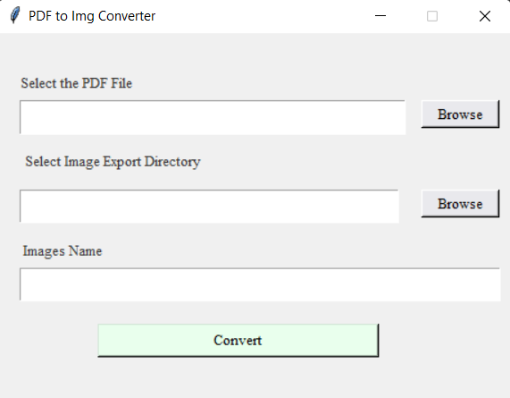

**PDF to Img Converter**

This Python program converts the PDF file to image format. GUI was made using TKinter. This program uses PyMuPDF to access th PDF file.

Screenshot of the Application

To install the required PyMuPDF module use the following script.

    python -m pip install --upgrade pip
    python -m pip instalrdz     l --upgrade pymupdf

